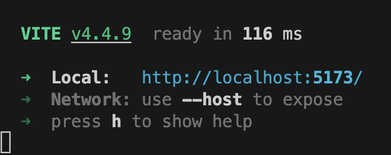
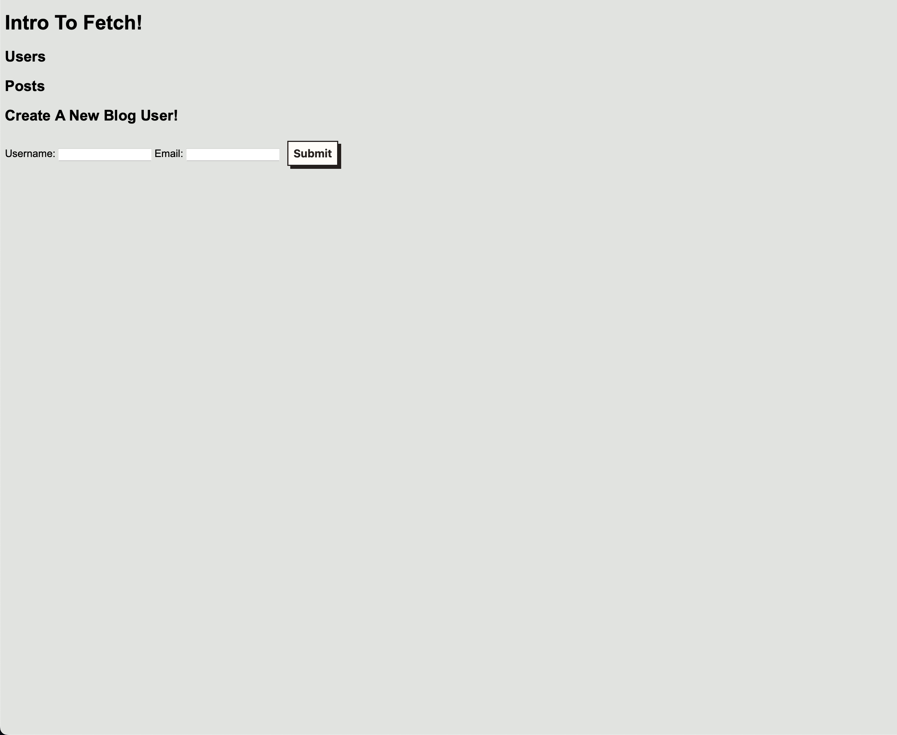
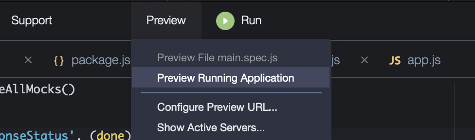
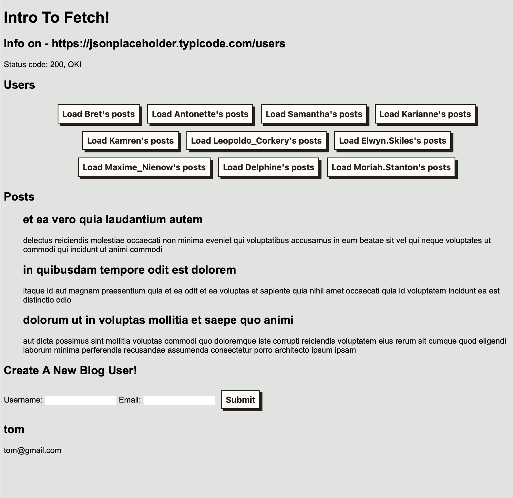

# Assignment 6.1 - Fetch!

In this assignment we're going to use the free, open source, practice API https://jsonplaceholder.typicode.com. We're going to use the users and posts endpoints to list users, list a user's posts, and then create a (fake) new user! We'll also practice rendering our results.

## Before you begin
We're using Vite now! Vite is a "bundler" which lets us do a *lot* of cool things. It lets us use imports and exports, just like we did in node. This is important because we need to have more fine grained control. But what's really cool, is the code will now be hosted by a dev server with Hot Module Reloading (HMR). That means it will also automatically reload the changes to a page whenever the site's code is altered. This adds up in terms of time saved!

To do this assignment, clone down your repo, cd into it and run:

```bash
npm i
npm run dev
```

In your terminal, Vite will show you something like this:



Go to whatever url it shows (it will likely be http://localhost:5173/). The number on the tail is the port number by the way, and it may change if you already have a vite dev server running.

Once you visit the page, you should see the starting page.



And you're good to go! To stop the server, click into the terminal where the server is running, and press `CTRL-C`.

## AWS Cloud9 Setup
If you aren't running locally yet, the setup isn't much different. Go to your Cloud9 environment, clone down your repo, cd into it, and run:

```bash
npm i
npm run dev:aws
```

Then, instead of going to the url, go to the top of the page and hit "preview > preview running application"



That will then open up the browser preview of the page, which you can then interact with or pop out like you always have.

**For best AWS Cloud9 Results, please use the Google Chrome Browser**

## App structure
This assignment is trying to mirror how a real world application would run. You have your network layer with all your fetches in `fetch-functions.js`. Then, you need to render that data, so build your rendering utilities in `render-functions.js`. You need to put everything together, and that's where `app.js` comes in.

Those three files allow us to isolate our workflows and build *mostly* pure-ish functions (the render functions aren't pure, as mutating the dom is a side effect, but ideally we always mutate the same way). Thanks to Vite we can test each function easily as well.

Finally, we take *just* the `app()` function and use it to run our application in `main.js`. That file's only responsibility is to feed in a `div` and import any css we may need. Do not add logic to `main.js`, consider `app()` as the edge of our world. This way of thinking will make testing `app()` easier, since we can feed any `div` into `app()` and our entire application will render like it always does.

# Section 1 - Fetching the data
First things first, we need to fetch our data. in `main.js` you can see we're logging the functions already. As you fill them out, uncomment them to check your progress (and of course use the tests too!).

Fill out your answers in `fetch-functions.js` and run the tests in `fetch-functions.spec.js`

# Question 1 - checkResponseStatus
- **URL** = https://jsonplaceholder.typicode.com/users
- **HTTP VERB =** GET
- **FUNCTION ARGS =** None
- **FUNCTION RETURN:**
  - A promise containing the fetch response's `status`, `ok`, and `url` properties

# Question 2 - getUsers
- **URL** = https://jsonplaceholder.typicode.com/users
- **HTTP VERB =** GET
- **FUNCTION ARGS =** None
- **FUNCTION RETURN:**
  - A promise containing an array of users

# Question 3 - getUserPosts
- **URL** = https://jsonplaceholder.typicode.com/users/{users id}/posts
- **HTTP VERB =** GET
- **FUNCTION ARGS =** (userId: number, maxNumPosts: number - default to 3)
- **FUNCTION RETURN:**
  - A promise containing an array of posts that belong to the given user, as identified by their id number. There are LOTS of posts, but you must limit the number by `maxNumPosts`, with a default value of 3.

> Note: Hey, it looks like a `User` has many `Posts`. So we identify the user id, and then get a list of all their posts. Relationships are everywhere!

# Question 4 - createNewUser
- **URL** = https://jsonplaceholder.typicode.com/users
- **HTTP VERB =** POST
- **FUNCTION ARGS =** (newUserData: an object containing a `username` and `email` properties, both strings)
- **FUNCTION RETURN:**
  - A promise containing an new `user` object. The object should contain the given `username` and `email` properties from the `newUserData` object you passed in, but *also* the API should assign you a new id.

> IMPORTANT: since this API isn't really saving our data, the id passed back will always be `11`, but that's fine for us, we're simply practicing `POST`ing data with fetch


# Section 2 - Rendering functions
Once you get your data, you actually have to use it. Now, there are 2 steps: first you need to make the rendering functions, and then you need to use them. We'll test using them in section 3, for this section, only write the functions in `render-functions.js`.

Note that we already have a `setupPageBasics` function. Don't touch it, that's just a helper to make sure our page is always setup correctly via JS (instead of html). This is how real frameworks tend to do it, as you can't typically write raw HTML. You have to do everything in JS!

By the way, this is the eventual end result that we're aiming for:



# Question 5 - renderStatus
- **FUNCTION ARGS**
  - **statusDiv**: an html element of a div, this is what the function will modify
  - **statusInfoObj**: an object with `url`, `status`, and `ok` properties. `url` is a string, `status` is a http status number, and `ok` is a boolean

The function should create in the given div:
- h2 tag
  - This will have an `id` of 'status-heading' and text content of "Info on - [url]"
- p tag
  - This will have an `id` of 'status-code' and text content of
  "Status code: [status code], [if `ok` is `true` then print 'OK', otherwise print 'FAIL']"
  - examples:
    - Status code: 200, OK!
    - Status code: 500, FAIL!

# Question 6 - renderUserButtons
- **FUNCTION ARGS**
  - **usersUl**: an html element of a `ul` that we will add `li`s to
  - **users**: an array of `user` objects, each will have a LOT of properties from the API, but the only ones we care about for this function are `username` and `id`

This function will mutate the given `ul` by creating `li`s with `button` elements inside them. For each `user` in the `users` array, create a `li` like this:

```html
<!-- for a user { username: 'Bret', id: 1 }, the final html li should be -->
<li class="user-card"><button data-user-id="1">Load Bret's posts</button></li>
```
 __*DON'T FORGET THE DATA ATTRIBUTE!*__

# Question 7 - renderPosts
- **FUNCTION ARGS**
  - **postsUl**: an html element of a `ul` that we will add `li`s to
  - **posts**: an array of `post` (as in "blog posts") objects, each one will have an `id`, `title`, and `body` attribute.

This function works just like `renderUserButtons`, but it makes posts instead of buttons. It will render out however many `posts` its given into the `ul`:

```html
<!-- for a post: { id: 1, title: 'My title', body: 'lorem ipsum...' } -->
<li><h2>My title</h2><p> lorem ipsum...</p></li>
```

Note: all the titles and bodies of the api are fake latin gibberish.

# Question 8 - renderNewUser
- **FUNCTION ARGS**
  - **newUserDiv**: an html element of a `div` that we will mutate and add our `newUserInfo`
  - **newUserInfo**: an object with a at least a `username` and `email` property, both are strings

This function is real simple! No arrays, just mutate the div to have an `h2` and `p` tag, no id's necessary.

```html
<!-- for a user {username: 'chuck12', email: 'chuck@gamil.com'} -->
<h2>chuck12</h2>
<p>chuck@gmail.com</p>
```

## innerHTML vs nodes
So this is a crucial question: can you set the `innerHTML` or do you need to create isolated nodes one by one? The answer is: can you trust the data? If you *know* the data isn't user generated (like status codes) then `innerHTML` is ok, but if you're ever entering text that *could've* come from a user, use nodes for safety. No malicious JS is going to sneak into our pages!

# Section 3 - App
Ok, last part! The final test is putting everything together, these are called "integration" tests. We already call the `app` function in `main.js`, so you should see this output there. Let's also mix things up and use user stories (which are of course backed up by tests). Use all the fetch and render functions we just made!

- our page should render the status of `https://jsonplaceholder.typicode.com/users` properly
- All 10 user buttons should be visible at the start of the page
- Since we haven't requested any yet, no posts should be displayed
- When we click on a user's button, it should load up 3 of their posts in the post section
- When we click on another user's button, the previous 3 posts should vanish, and be replaced by 3 new posts
  - hint: handle clicking these buttons with event delegation!
- We should be able to create a new user with a username and email when we click submit on the form
- When we click submit on the form, we should hit the `typicode` api, and get back a user object
- When we click submit on the form, we should then see the username and email printed out below in the section under the form
- When we click submit on the form, the form clears itself
- We can fill out the form as many times as we like, and the new user section will only show the latest user
  - hint: Don't forget to use the FormData browser API to handle your form data!

OK! This is a lot to think about, but you can do it! Just remember to move slowly. First get your fetches, make sure you have the right data. Then move on to the render functions, and only once you know all those work, move onto the final App section.

A quick note about the tests. We're faking our network calls, (don't make real network calls in tests that's unreliable), but this means you might get some less than helpful messages. `nock` will fail your test if you try to make a request for a route we haven't faked. Make *sure* each fetch function only fetches *once* and the url is exactly correct, ok?

Also, if you want to console log things in your tests, don't forget to scroll up in the terminal to see the log output!

# Short Answers
And finally, don't forget to do your short answers! They cover important topics that you'll need for the web!